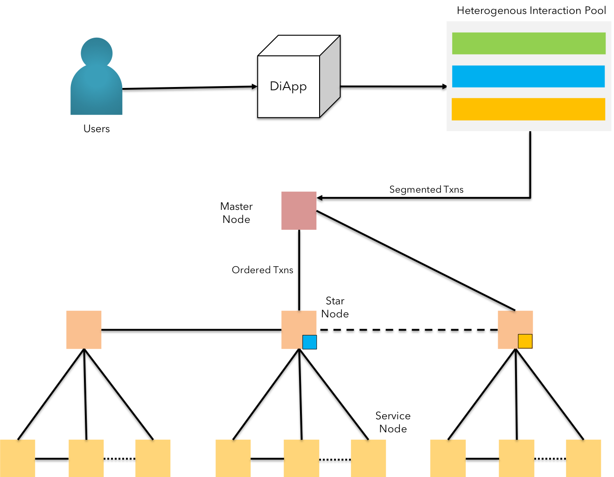

### Modulated Trust

KIP leverages the concept of selective hearing<sup><a href="#references">[9]</a></sup> in the network to facilitate modulated trust. The concept of state channels presented in this paper is different from the concepts used by the ethereum & other blockchain networks to address throughput. Selective hearing in distributed computing network is a well-practiced to address the interest of a sub set of nodes responsible for persisting / operating the relevant information.

Similarly, enterprise stakeholders in a heterogenous business network operate to persist transactional information that favours their respective success. The "single floor communication" philosophy adopted by blockchain has been observed as a challenge, to differentiate priorities between verifying transactions pertaining to lower & relatively higher asset values.



<p align="center"> <b>Fig 2:</b> KIP - Modulated Trust & NTQ-based state channel approach <sup><a href="#references"></a></sup> </p>

KIP maintains the credibility of the verifying nodes by aggregating the performance & behavior of the nodes and attributing it to NTQ - Node Trust Quotient.
Each new node added into the KIP network is automatically assigned the role of an orphan. The node is vetted by requesting for vesting a finite number of KIP Tokens as well as uptime to confirm transactions of sorts in the shadow pool for a finite period of time.  

As the node gets attributed with sufficient NTQ scores, the network's distributed intelligence will allocate the node to suitable state channels.  

The network-level definition of a node is as follows:

``` go

// Node represents a host on the network.
// The fields of Node may not be modified.
type Node struct {
	IP       net.IP // len 4 for IPv4 or 16 for IPv6
	UDP, TCP uint16 // port numbers
	ID       NodeID // the node's public key

	RaftPort uint16

	// This is a cached copy of sha3(ID) which is used for node
	// distance calculations. This is part of Node in order to make it
	// possible to write tests that need a node at a certain distance.
	// In those tests, the content of sha will not actually correspond
	// with ID.
	sha common.Hash

	// whether this node is currently being pinged in order to replace
	// it in a bucket
	contested bool

}

var NodeRoleMap map[common.Hash]uint
var NodeStateMap map[common.Hash]uint

```

where, the `NodeStateMap` and `NodeRoleMap` are dynamic mappings used to refer to the nature of the nodes by the sha3<sup><a href="#references">[10]</a></sup> of their Node ID. The mappings are instrumental in identifying the nature of nodes during DHT lookups<sup><a href="#references">[11]</a></sup>.

The decision to route the transport of information is made based on the Kademlia's<sup><a href="#references">[12]</a></sup> bucket lookups. In KIP network, nodes are required to persist three k-buckets with each bucket's size limiting to, but not limited to 16 with a concurrency factor of 3, to facilitate operations across all buckets corresponding to lookups among Master Nodes, Star Nodes & Service Nodes respectively. 

Distance between the target is compared as followed:

``` go
// distcmp compares the distances a->target and b->target.
// Returns -1 if a is closer to target, 1 if b is closer to target
// and 0 if they are equal.
func distcmp(target, a, b common.Hash) int {
	if(NodeRoleMap[target] == NodeRoleMap[a] == NodeRoleMap[b])
	{
		for i := range target {
			da := a[i] ^ target[i]
			db := b[i] ^ target[i]
			if da > db {
				return 1
			} else if da < db {
				return -1
			}
		}
		return 0
	}
}
```

`distcmp` ensures to route transactional information only to nodes belonging to the same level of participation.

KIP offers a method of differentiation in prioritizing the transactions by facilitating the diApp run by businesses to form a consortium of nodes represented by its important stakeholders.

> **KIP State Channel - Formal Notation:**  
>
> **STEP 1:** Interested peers of a particular asset class run the Node (The Peer of the state channel)  
>
> **STEP 2:** Node is added into the state channel by `addPeer(node, StateChannelID)`, according to the interest specified during benchmark. This is the *"Follower Node"*.  
>
> **STEP 3:** Peers of the state channel vote & elect a judge node, run by regulators & compliance practitioners, to distribute asset-specific transactions & confirm the validation from peers. This is the *"Star Node"*  
>
> **STEP 4:** Signed transactions are formally verified by the peers of the state channel & confirmed by the leader (star node). This is *"Fast Forwarding"*.  
>
> **STEP 5:** The confirmed transactions are propagated by the star node of the current state channel to those of other state channels followed by the idle orphans in the the shadow pool  
>
> **STEP 6:** The star nodes receive the fast forwarded transactions & broadcast them to the peers of their respective state channels. Follower peers observe the verification by appending them into their Tx Log  
>
> **STEP 7:** The idle orphans also receive the fast forwarded transactions & observe the verification by appending them into the Tx Log  
>
> **STEP 8:** STEP 6 & STEP 7 collectively forms "Shadow Broadcasting". Blocks are produced by packaging the transactions & height of the network is updated to the latest upon broadcast confirmation  

**Description 4.4:**

$$
Total Hops = { \iota( \iota - 1 ) } + { s( s - 1 ) }\\\\
O(n^2)
$$
