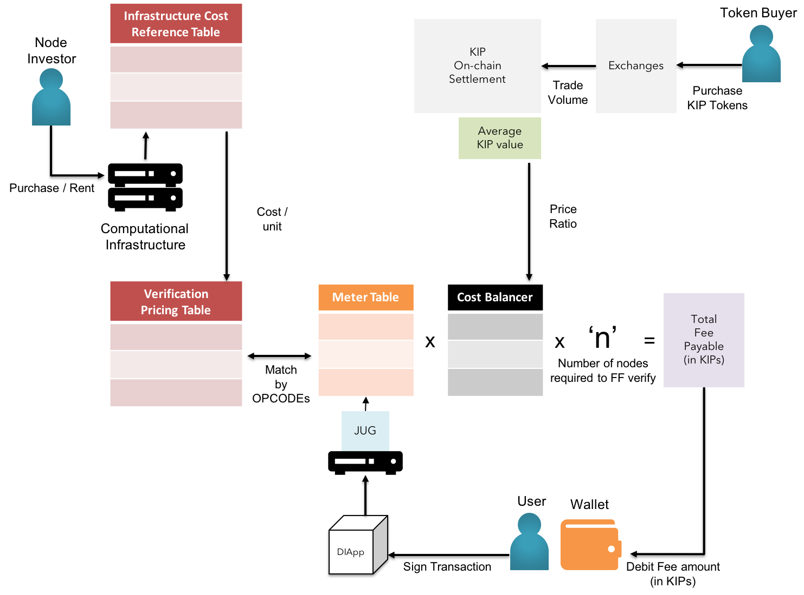
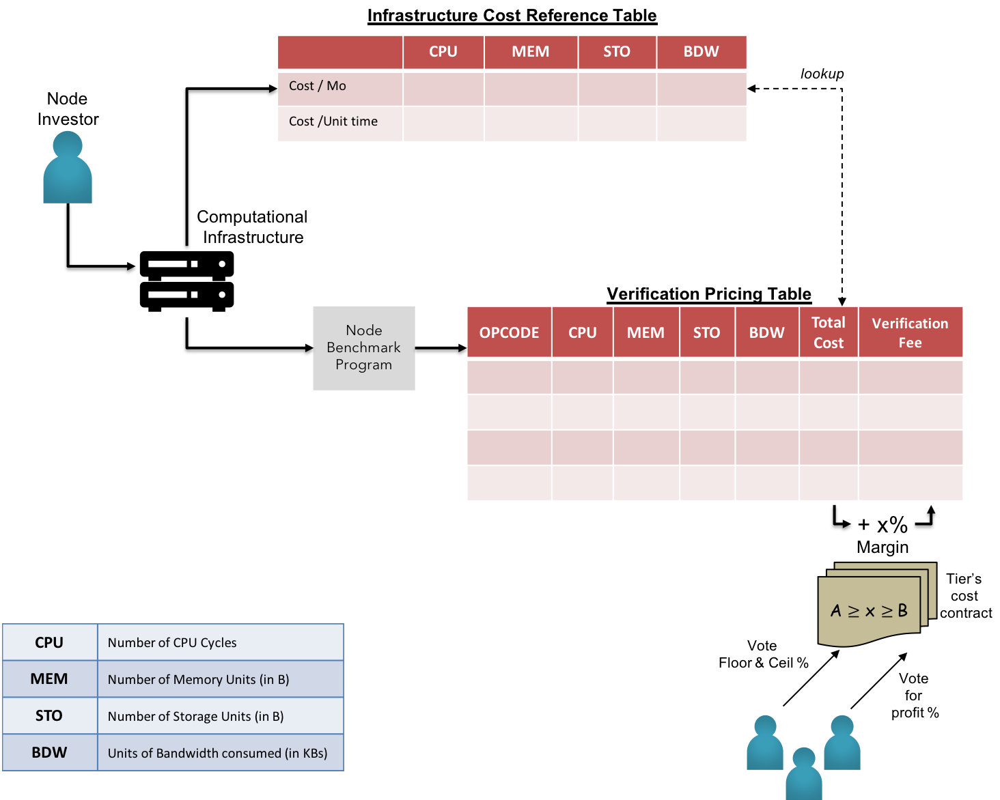
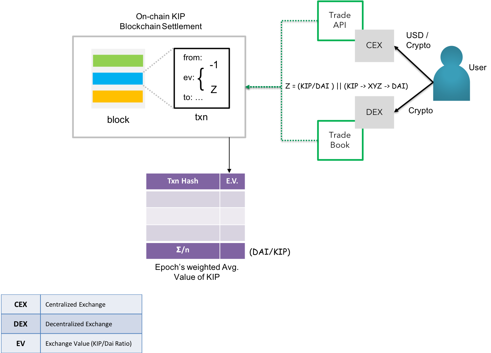
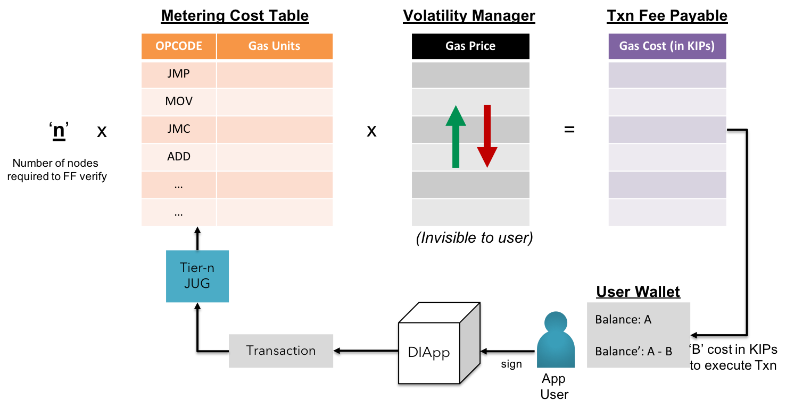

### Stable gas cost

In the interest of long-lasting adoption & predictable TCO(Total Cost of Ownership), KIP promotes the concept of stable gas cost to balance the economics of using the platform resources. This is made possible by the concept of weighted volatility management.

 <b>Fig 4:</b> KIP - Macro view of Gas Cost Stabilization  

**Description 4.7:**

$$
\Delta
$$

Node Benchmark program in each on-boarding node uses Pricing API to fetch updated prices of compute, memory, storage & bandwidth units from respective infrastructure service providers. In case of on-premise resources used by a sub-set of nodes, KIP members are entitled to govern a benchmark program that could closely predict the cost to performance ratio & propagate the output in parallel to information fetched by the oracles mentioned above. The cost aggregator is applied on the obtained array of variate costs, ensuring no loss covered by owner running the nodes with cost in the maxima region of the cost distribution.

 <b>Fig 5:</b> KIP - Fair Market Value of Infrastructure Cost & Verification Costs 

Aggregated cost is calculated based on the tier of hardware independent of the cloud service provider, to ensure covering loss gap for node operators in the maxima region. The new calculated costs are propagated to the network for approval by node operators in the respective tiers. The voting diApp termed as *Tier Cost Contracts* is used by the vested node operators to update the costs upon the approval by majority of eligible node operators. The new costs are made effective within a specific epoch, which is again subjected to voting by the same.

**Description 4.8:**

$$
\Delta
$$

 <b>Fig 6:</b> KIP - On-chain KIP Token Price Discovery  

KIP also exhibits an extensive ability to record the economic value of exchange transactions for KIPs paired directly with a decentralized virtual currency such as the Dai(A decentralized stablecoin on Ethereum)<a href="#references">[16]</a>, or paired indirectly with other cryptocurrencies available for trade. The objective is to derive at a weighted average value of KIP vs. a stablecoin pegged to a major reserve such as the US Dollar for balancing the associated costs. The average shall be weighted against the Dai/KIP ratio and reset by new values on announcement of new epochs, as voted by vetted KIP holders & node managers.

&nbsp;
The cost to performance ratio calculated by the benchmark program is recorded in a transparent index maintained by respective nodes. The ratio for each OPCODE class is aggregated based on the tier & the global lookup index is updated each time a finite set of new nodes are added or removed belonging to the specified tier for an epoch.

**Description 4.9:**

$$
\Delta
$$

The GasTables for each OPCODE & mathematical functions are also maintained in the form of an index.

 <b>Fig 7:</b> KIP - Internal view of volatility management in gas costs  

The gas cost balancer comprises of a self-balancing utilitarian formula which compares the estimated gas required with the computational cost to execute the same in the specified tier and variates the gasPrice to match the total of verification price to achieve finality among all `n` nodes.

> **Gas Cost Balancer - Formal Notation:**  
>
> **STEP 1:** Node Benchmark program simulates the execution of each OPCODE & convert the gas units into infrastructure costs (sum of the cost of facilitating CPU time, memory, storage & bandwidth)
>
> **STEP 2:** The calculated infrastructure costs are reverse converted to equivalent native tokens
>
> **STEP 3:** The gas cost of the calling functions & variables in the smart contract is calculated by the interpreter by the number of gas units.
>
> **STEP 4:** Gas Price per gas unit is varied to balance the total gas cost per Txn per node
>
> **STEP 5:** The gas cost to achieve consensus throughout the network is calculated by sum of gas cost of Txn per Fast Follower node & the gas cost of Txn per Shadow Broadcast node.
>
> **STEP 6:** The fee (total gas cost) is paid by the user in fractions of KIP token.
>
> **STEP 7:** The fee is embedded in the transaction payload along with the nonce & timestamp
>
> **STEP 8:** The transaction is ordered, verified & finally confirmed over a number of epochs
>
> **STEP 9:** The client is notified of the Txn verification & state changed as per the UX defined

**Description 4.10:**

$$
\Delta
$$

There is an extremely minimal chance of nodes rejecting the formal verification of the propagated Txns as the incentives needed are fulfilled as specified by the node operators during the bootstrap & consequent voting.  