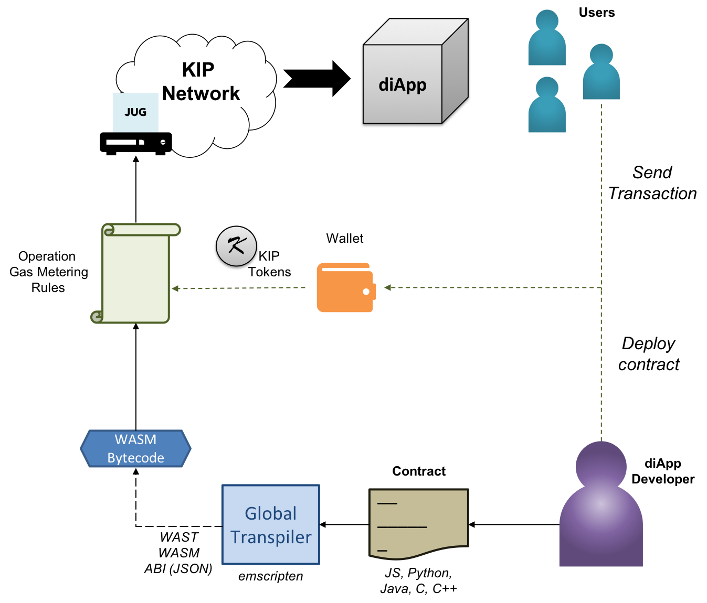

## Blockchain Realm

KIP enables businesses to harness the integration of 3rd generation of blockchain technologies built with stable design thinking principles. KIP shall natively supports an enhanced version of ethereum based on `TARA` consensus algorithm.

### JUG - The EVM++

The native 3rd generation blockchain technology offered by KIP exhibits specific ability to execute all instructions and standard cryptographic & mathematical functions similar to other blockchain platforms, yet maintain the volatility in the gas cost borne by the developers and end users. More on the approaches to balancing gas costs are mentioned under Stable gas cost section of this paper.

 <b>Fig 14:</b> KIP JUG & Blockchain  

$$
\Delta
$$

Contrasting KIP's execution environment JUG with Ethereum's EVM, whose acceptable uses include running specific business logic constructs such as *"if this then that"*, verifying signatures and other cryptographic objects; whereas JUG is an extended version of EVM, to facilitate more complex and wide varieties of functions and instructions to cover complex constructs of business logics across various domains of applications. As made aware in the above sections, computational steps on the EVM are very expensive for an unjustified amount of vastly concurrency (except as mentioned under its Whitepaper & Yellowpaper).

A set of Extensive OPCODEs are updated in the wrappers for respective languages corresponding to environments mentioned under `Leypa` for a developer-friendly environment.

 <b>Fig 15:</b> JUG - Interactional Overview  

Apart from JUG's support to an extensive Instruction Set in place, we aim to make it compatible with light-weight clients deployed in nodes capable of predictive performance, although limited in its own limit, can be segregated into tiers for class-based execution, in contrast to "computing all" philosophy of the former blockchain platforms.