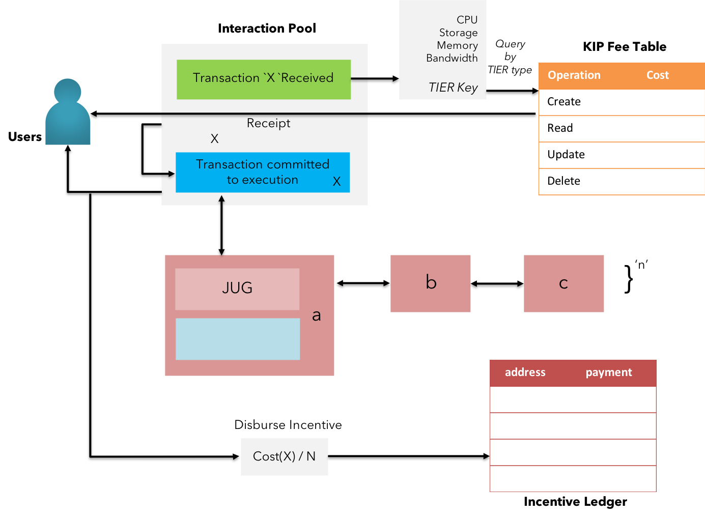

### Platform fee & incentivization

 <b>Fig 16:</b> KIP Incentivization model  

Platform fee is not just the cost of computational operations but also represents an economic interest to protect the system from sybil attackers by levying a specific cost to achieve determined output. KIP's platform fee & the incentivization model is also developed around similar thinking. However, KIP offers absolute ease and a new efficient method that overcomes a few limitations in the former.

KIP offers the user to select the execution tier, upon which the platform fee shall be calculated. The concept of tier-based execution is introduced to address the unnecessity involved in executing a signed transaction of relatively lower importance / asset value across the entire network. This is made possible by using KIP's state channels hosted by interested consortium members on various types of hardware(collectively called the "Tier"). The cost associated with executing the instructions among the subset of nodes forming the state channel is calculated. Similarly, the to transmit the formally verified & processed information is added to the fee.

**Description 6.2:**

$$
\Delta
$$

The total computed cost is transmitted back to the user for approval. In contrast to the variable balance between the `gasLimit` allowed and the `gasPrice` that can be set by the user in former, KIP understands the nature of enterprise permissioned networks in the form of superset of state channels distributed in clusters. The balance is now achieved by maintaining an inherent scale of gasPrice that can be varied against changes in the cost to maintain the hardware corresponding to respective tiers. More on the tier-based cost balancing mentioned in the Stable Gas Cost section.

**Description 6.3:**

$$
\Delta
$$

Apart from the stable gas cost, KIP features a transparent method of fee distribution by maintaining a global incentive ledger.