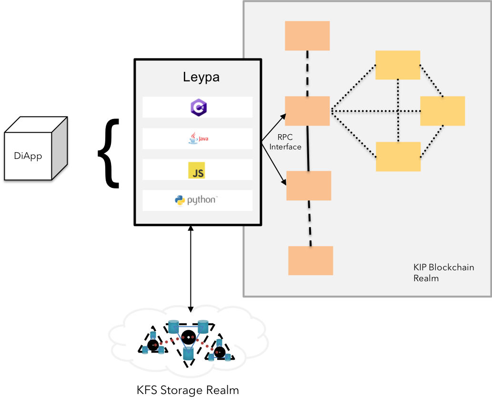

### Data interface for Apps

 <b>Fig 21:</b> KFS Data Interface with Leypa  

KIP offers a native ability to integrate the diApps to KFS and other storage realms through Leypa, a web3-like integration library supporting both mobile & web applications deriving functionalities from diApps.

More on Leypa specified at [KIDE & Krama Services Specs](/pages/specs/kide/kide-specs.md) document.

> **Permissioned CRUD Operations - Formal Notation:**  
>
> **STEP 1:**  User initiates the transaction by signing with the KIP account private key
>
> **STEP 2:** Transaction is wrapped up with nonce, platform fee, data, value, tier and specific KFS Cluster ID by diAPP
>
> **STEP 3:**  The diApp will transfer the user's request through Leypa to Krama Service Interface
>
> **STEP 4:** When the user request to `CREATE` a file on KFS, Leypa transports the payload to KSI orchestration network and requests to store on specified KFS cluster, returning its `KFS file identifier` on successful write operation
>
> **STEP 5:** When the user request to `READ` a KFS file by its `KFS file identifier`, Leypa transports the request to KFS for lookup by the given ID. Successful lookup returns the content of the file, else returns an error message with appropriate code.
>
> **STEP 6:** When the user request to `UPDATE` a KFS file by its `KFS file identifier` along with the new content, Leypa transports the new payload to be updated and requests for lookup by the given file identifier and update the new content to the file. Successful update returns the new hash else returns an error message with appropriate code.
>
> **STEP 7:** 
> When the user request to `DELETE` an existing KFS file with a `KFS file identifier`, Leypa transports the command to KSI which requests KFS to lookup by the given ID . Successful lookup will delete the content of file, remove the Merkle DAG leaf and update the path, else returns an error message with appropriate code.

**Description 7.3:**

$$
\Delta
$$