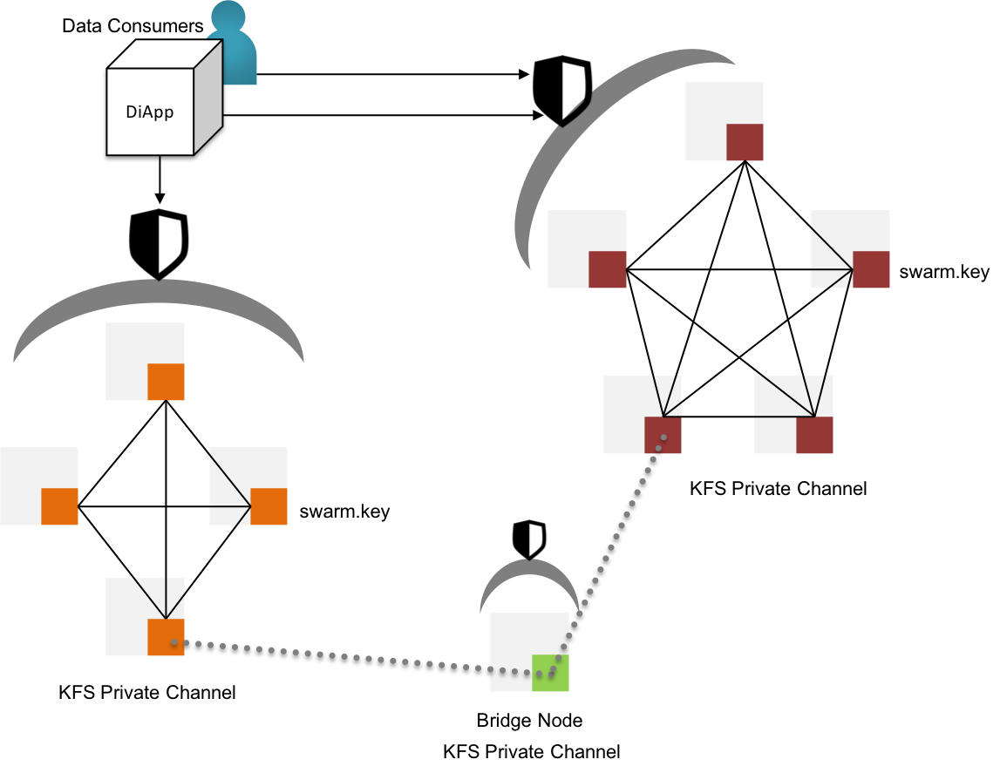

## Storage Realm

As a hybrid mesh, KIP offers the user to store information into permissioned datastores in a decentralized manner with comprehensive abilities to share the stored information to a limited number of audience in an encrypted medium.

### Permissioned Storage

KIP offers a native decentralized file storage system called Krama File System(KFS). The file system offers a few groundbreaking measures to reduce the unneeded cost of storing the data on blockchain.  

KFS stores the information and persists changes to the stored information in cryptographic signatures with new checksum-like signatures representing the change in state. KFS is an extension to the IPFS(InterPlanetary File System)<a href="#references">[18]</a>.

 <b>Fig 18:</b> KFS - Permissioned Storage & Proxy channels for inter-channel data sharing  

KIP initiates permissioned KFS networks by deploying a genesis node with a custom swarm key<a href="#references">[19]</a>. The swarm key shall be shared with other nodes that are willing to participate in the permissioned networks. Evidently, the new nodes joining the network with reference to swarm key have access to the files stored in the genesis node & the other predecessor nodes within the *swarm*.

KIP shall also support the ability to request data via RESTful API from other swarms by bridging two or more disparate swarms, keeping the partition between swarms intact.