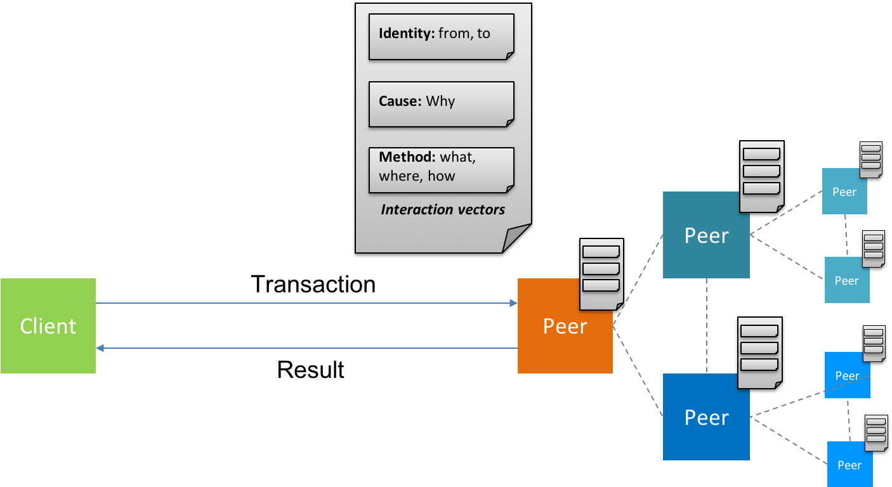
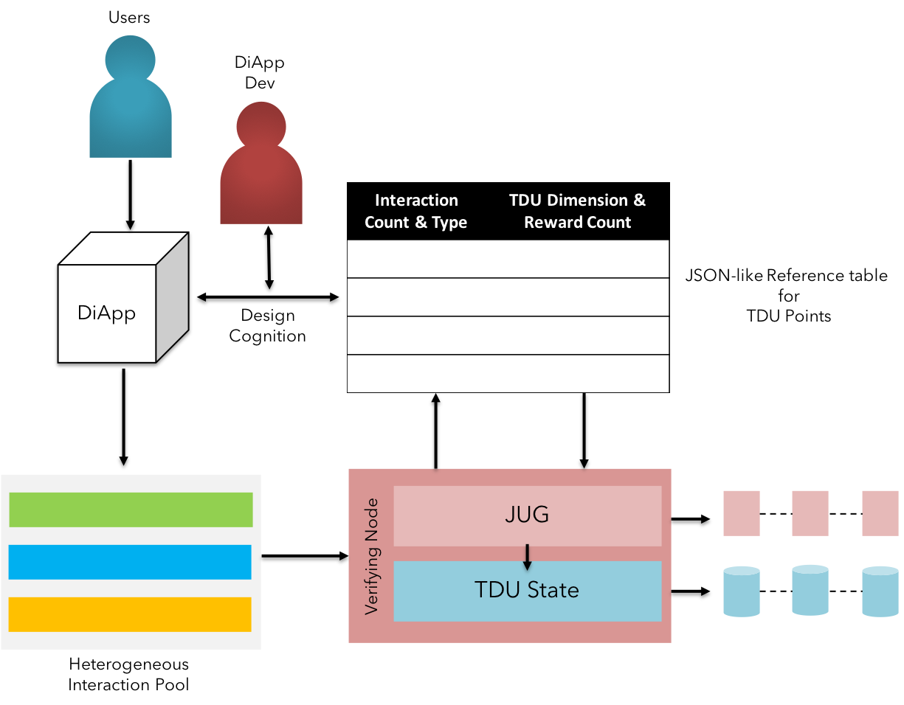

### TDU - Total Digital Utility

KIP's wallet is enhanced with an addition of new attribute - TDU, a new mechanism with a collective measure of values, in high frequency transactional environment.

 <b>Fig 8:</b> TDU - value capture mechanism with interaction vectors 

$$
\Delta
$$

Blockchains could not only be used to secure integrity and achieve transparency, but also harness the intents to create values. Although a few blockchain platforms offer the means to capture and relay the transactional metadata, the mechanisms to aggregate and refer to the same in an ubiquitous manner is seldom practised.

KIP introduces the TDU factor by leveraging the application of *Interaction vectors* - the hybrid information vectors setup to source the background of a given transaction. A commercial transaction to purchase goods/service online can be motivated by several factors. The level of transparency introduced by the blockchain enables the information vectors to be categorized into 3 basic categories:

- *Identity vectors:* This is a fundamental vector used to identifying the KIP wallet account responsible for the transaction. In both cases of either a PUSH or PULL transaction, the sender & the recipient address are attributed to `from` and `to` keys respectively. The from & to attributes can be of any nature - managed by an individual owner OR a smart contract managed by external users.

- *Causal vectors:* This fundamental vector is used to capture the intent behind a transaction. The attribution of the reason or the cause to initiate a purchase transaction of commodity, relative to a timeline in efforts, could be of incremental value to enterprises. The circumstances influencing the decision to initiate the transaction is attributed in the causal vector & hence the content is fairly dynamic.

- *Method vectors:* This fundamental vector is a continuation to the efforts of the causal vectors. Each transaction propagated in the KIP network is a payload attributed with timestamp, nonce, fee & associated asset class at any given time. The means to achieve the fulfillment & finality of the transactions are the typical attributes of this vector. The conditions influencing the decision to initiate the transaction is attributed in the causal vector & hence the content is fairly dynamic.

 <b>Fig 9:</b> TDU - Persistence of multi-dimensional value  

$$
\Delta
$$

The values captured by the above type of vectors are attributed in a microscopic JSON-like documents, structured and stored in a fully decentralized database (such as Redis, Riak etc.).

The microscopic attributes are aggregated by account type & id, at the end of specified number of epochs.

> **TDU - Formal Notation:**  
>
> **STEP 1:** User initiates a transaction with an intent to purchase a good or consume service.
>
> **STEP 2:** The transaction is generated once signed by the user's private key along with sender & recipient address, attributed to `from` and `to` of the *identity vectors*.
>
> **STEP 3:** The *causal vectors* are attributed with the behavioral patterns captured by the diApp, before and after the transaction has been signed by the user.
>
> **STEP 4:** The payload attributes such as `timestamp`, `nonce`, `payload length`, `fee`, `tier` etc. are captured into the *method vectors* when the signed transaction is transported from the diApp to the network's transaction pool.
>
> **STEP 5:** The network-level dynamics subjected to fulfil and finalize the given transaction is recorded until the epoch of confirmation expires.
>
> **STEP 6:** Each set of capture pertaining to the concerned user accounts are aggregated by their wallet address. This set is called a "Burst".
>
> **STEP 7:** The bursts are then passed as an input to stored procedures in a data-driven training model to gain an aggregated measure of value.
>
> **STEP 8:** The obtained value is categorized based on the asset affected by the transaction.
>
> **STEP 9:** The categorized value is averaged with preceding values in the respective KIP wallets.
>
> **STEP 10:** The corresponding TDU balance is updated throughout the network

$$
\Delta
$$